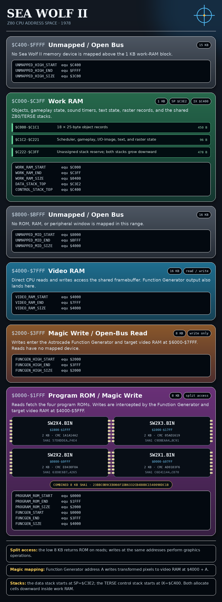
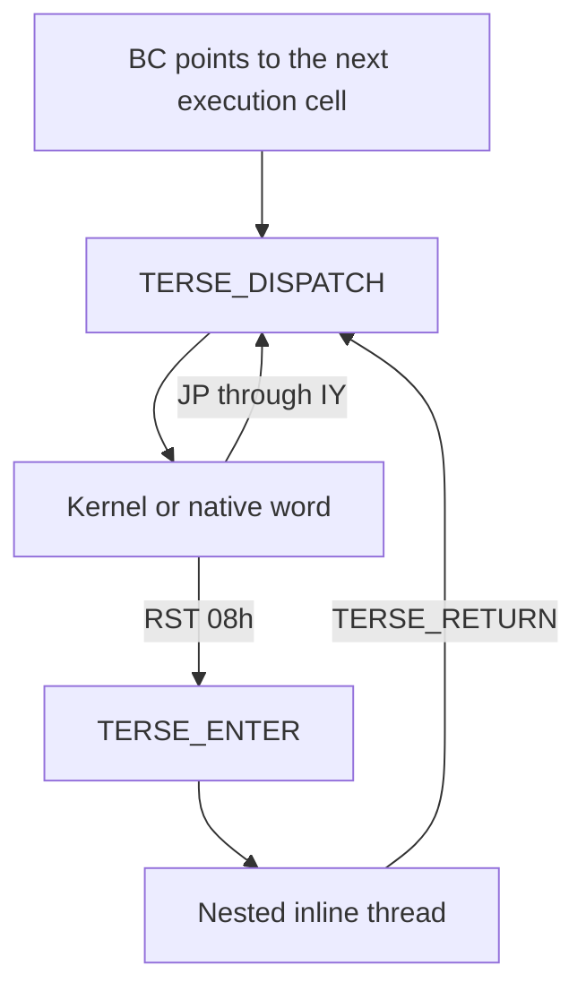
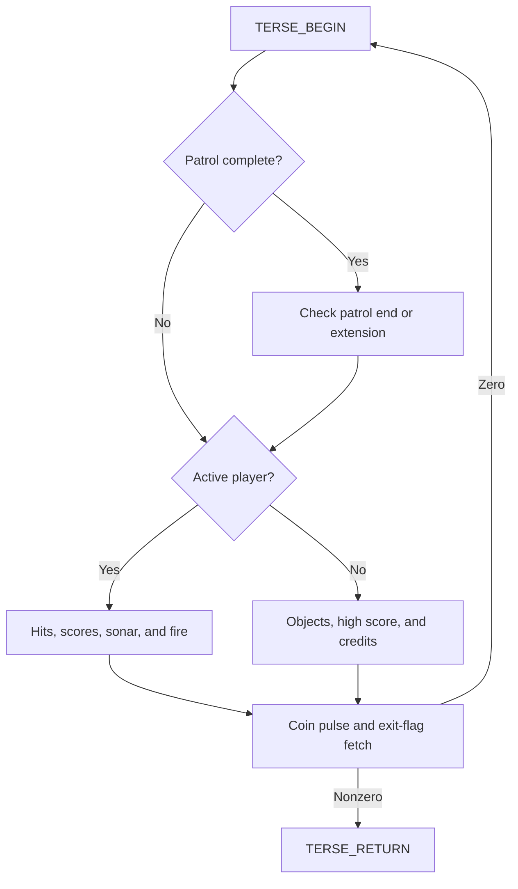
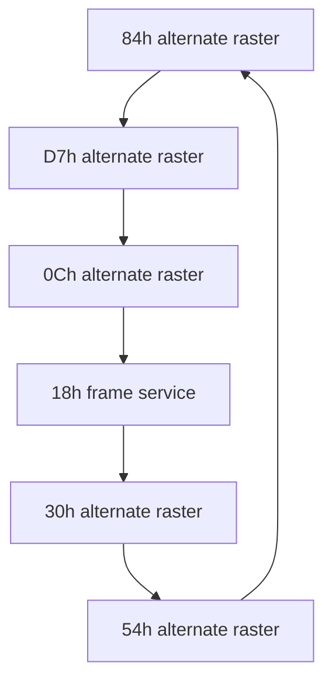
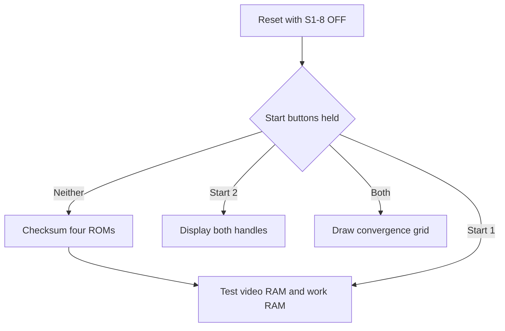

# Sea Wolf II

This project is a byte-exact reconstruction and reverse-engineering baseline for **Sea Wolf II**, released by Dave Nutting Associates (DNA) / Midway in 1978.

Sea Wolf II is a notable DNA title because most of the game
is implemented in TERSE, DNA's direct-threaded Z80 language. Native Z80 primitives, 16-bit threaded addresses, inline operands, graphics, text, and tables share the same 8 KB ROM image. 

## Reverse Engineering (RE) Status

|  |  |
| --- | --- |
| [ROM identity and build](#rom-organization) | All four source ROMs retain the canonical MAME CRC32/SHA1 values. zmac 1.3 produces the byte-identical 8 KB image, which runs in MAME 0.289. |
| [Objects and gameplay](#object-lifecycles) | The 25-byte object ABI, three scheduler pools, nine object types, movement, collision, scoring, overlays, patrol completion, and torpedo/target/mine/Super Sub lifecycles are mapped. |
| [Graphics and text](#structured-graphics-and-tables) | 43 font glyphs, localized prompts, status graphics, 26 referenced object descriptors, 2 unreferenced descriptors, self-test patterns, and both trajectory tables are bounded and labeled. |
| [Sound](#discrete-sound-control) | Sound timers, port `$40/$41` packing, sonar, hit, torpedo, dive, and coin-counter timing are documented. |
| [TERSE](#terse-execution-architecture) | 11 kernel primitives, 21 native application words, six threaded programs, inline operands, calling conventions, register preservation, interrupt interaction, and maximum stack depths are documented. |
| [Native code and diagnostics](#service-diagnostics) | All reachable Z80 routines are expressed as assembly rather than `DB`. The four service entry modes, checksum and walking-bit algorithms, failure displays, handle screen, and convergence grid are documented. |
| [RAM and I/O](#ram-and-io-ownership) | Every live byte from `$C000-$C221`, work-RAM clear domains, stack reserve, aliases, raster records, object padding, reset-only cells, and ROM-used I/O ports are assigned or formally classified. |
| [Video and raster](#raster-interrupt-scheduler) | Both 6-entry schedules, IM 2 selection, interrupt handlers, moving split lines, Function Generator modes, Magic RAM usage, drawing, erasure, and collision reads are traced. |
| [Cabinet and controls](#cabinet-inputs-dip-switches-and-station-ownership) | Handle/start/coin inputs, S1 operator switches, service selection, station ownership, Gray-code decoding, the 32-way aim clamp, trajectories, and language contacts are resolved. The French-contact correction is tracked by [MAME PR #15989](https://github.com/mamedev/mame/pull/15989). |
| [Residual data](#remaining-raw-data) | All 2,761 remaining `DB` bytes are classified as TERSE operands, tables, graphics/text, padding, or checksum-balancing filler. No uncertain byte remains. |

## Project layout

| Path | Contents |
| --- | --- |
| `src/seawolf2.asm` | Reconstructed and annotated source |
| `build.sh` | Linux build and packaging script |
| `build.bat` | Windows build and packaging script |
| `tools/zmac` | Bundled Linux zmac 1.3 executable |
| `tools/zmac.exe` | Bundled Windows zmac 1.3 executable |
| `roms/original/seawolf2.zip` | Reference ROM archive |
| `samples/seawolf.zip` | Controlled MAME sound-sample archive |
| `docs/` | Manuals, schematics, and technical references |
| `images/` | Cabinet, hardware, and address-space reference images |


## Build

This source is built with Bruce Norskog's **zmac 1.3**. That version is the
required project assembler on both Linux and Windows. Both build scripts invoke
the bundled zmac 1.3 executable explicitly and place the assembled image at
`src/seawolf2.bin`.

Linux:

```sh
./build.sh
```

Assembler command used by `build.sh`:

```sh
./tools/zmac -o src/seawolf2.bin src/seawolf2.asm
```

Windows 10/11:

```bat
build.bat
```

Assembler command used by `build.bat`:

```bat
tools\zmac.exe -o src\seawolf2.bin src\seawolf2.asm
```

Each script performs the same four steps:

1. Assemble `src/seawolf2.asm` into the 8 KB image and listing.
2. Split the image into the four original 2 KB ROM filenames.
3. Create `roms/seawolf2.zip` for MAME.
4. Verify every generated ROM against its official SHA1 value and fail on any
   mismatch.

Generated files:

```text
src/seawolf2.bin
src/seawolf2.lst
roms/sw2x1.bin
roms/sw2x2.bin
roms/sw2x3.bin
roms/sw2x4.bin
roms/seawolf2.zip
```

## Run in MAME

From the project directory:

```sh
mame seawolf2 -rompath roms -samplepath samples
```

## Sound samples

Sea Wolf II's original discrete sound board is not yet emulated by MAME. MAME
plays five external samples in response to the game's output on ports `$40`
and `$41`.

The controlled sample archive for this project is:

```text
samples/seawolf.zip
```

Using `-samplepath samples` as shown above makes MAME load the archive directly
from this project. To use the controlled archive with an existing MAME setup
instead, copy `samples/seawolf.zip` into the directory configured as MAME's
`samplepath`. Display that directory with:

```sh
mame -showconfig | grep '^samplepath'
```

The sample archive must contain these five files at its root:

```text
dive.wav
minehit.wav
shiphit.wav
sonar.wav
torpedo.wav
```

The archive name is shared with the original **Sea Wolf** ROM set. A ROM
archive containing files such as `sw0041.h` and `sw0044.e` is not the sound
sample archive. Confirm the installed samples with:

```sh
mame seawolf2 -samplepath samples -verifysamples
```

## ROM organization

The four 2 KB ROMs form one contiguous Z80 image mapped at `$0000-$1FFF`.

| ROM | Address | CRC32 | SHA1 |
| --- | ---: | --- | --- |
| `sw2x1.bin` | `$0000-$07FF` | `ad0103f6` | `c6e411444a824ce54b0eee10f7dc15e4229ec070` |
| `sw2x2.bin` | `$0800-$0FFF` | `e0430f0a` | `63d8c6b77e0aa536b4f5bb774bc9285f736d4265` |
| `sw2x3.bin` | `$1000-$17FF` | `05ad1619` | `c9dbeaa4540dc95f98970f501a420b18b9898c91` |
| `sw2x4.bin` | `$1800-$1FFF` | `1a1a14a2` | `57d0ddea9f8bf082f50d0468a726fd91aaabf4e4` |

Combined 8 KB image SHA1:
`23bbc0b9ceb066f1db6332cb4b8bc1540090dc1b`

The 64 KB Memory Map illustrates the read/write semantics, ROM-device boundaries, open-bus ranges, work-RAM ownership, and stack placement.



## TERSE execution architecture

Sea Wolf II uses a direct-threaded TERSE engine. A threaded execution cell is a
little-endian native Z80 address. `TERSE_DISPATCH` reads that address through
`BC`, advances `BC` to the next cell, and jumps directly to the selected kernel
or application word. This is the game's foreground control architecture, not a
small isolated script engine.

The ROM contains 11 thread-dispatchable kernel primitives, 21 native
application words, and six complete threaded programs: the initial thread, the
nested initialization thread, the control thread, and three localized GAME
OVER threads. Every execution cell and 16-bit inline operand is expressed as a
labeled `DW`. The only TERSE bytes retained as `DB` are the five three-byte
Y/X/size operand groups consumed by `TERSE_DRAW_TEXT_INLINE`.



### Register model and dispatch ABI

| Register/address | TERSE ownership |
| --- | --- |
| `BC` | Threaded instruction pointer; points to the next execution cell or the current word's inline operand |
| `SP=$C3E2` | Downward-growing 16-bit TERSE data stack; also the balanced native Z80 call/push stack |
| `IX=$C400` | Downward-growing control stack for nested-thread return IPs and `BEGIN` loop addresses |
| `IY=$0043` | Native-word continuation, normally `TERSE_DISPATCH` |
| `RST $08` | Enter a nested inline thread through `TERSE_ENTER` |

`TERSE_ENTER` receives control through `RST $08`. The RST instruction pushes
the address of the inline thread on SP; `TERSE_ENTER` immediately pops that
address into `BC`, so the TERSE data-stack depth is unchanged. The caller's
previous `BC` is saved as a two-byte IX control cell. `TERSE_RETURN` restores
that saved IP and removes the IX cell.

Native application words enter after the dispatcher has advanced `BC` past
their execution cell. A normal word returns with `JP (IY)`. The source emits
the same tail instruction inside compact kernel words as:

```asm
DW      TERSE_DISPATCH_OPCODE   ; bytes FD E9 = JP (IY)
```

The application-word contract is:

- Preserve the advanced `BC` threaded IP, IX control state, IY continuation,
  and entry SP depth.
- Treat `A`, flags, `DE`, and `HL` as scratch. The dispatcher itself destroys
  `A` and `HL` while fetching the next execution address.
- Save and restore `BC` before using it as native workspace.
- Restore `IY` after using it as an object pointer or explicit continuation.
- Balance every native `CALL`, `PUSH`, and local data allocation before
  dispatch resumes.

`PULSE_COIN_COUNTER` and `CLEAR_GAME_STATE_AND_PLAYFIELD` deliberately accept
either the TERSE dispatcher or a native continuation in `IY`.
`START_SELECTION_AND_PROMPTS` temporarily saves `$0043` and uses an internal
continuation while polling the coin counter. Interactive service mode sets IY
to `$0277` before entering the common clear routine. The diagnostic
`JP (IY)` at the end of the walking-bit test is also a native descriptor
continuation, not a TERSE return.

### Kernel control entries

| Address | Source label | Function |
| ---: | --- | --- |
| `$0008` | `TERSE_ENTER` | Save caller BC on IX and enter the inline thread following `RST $08` |
| `$0043` | `TERSE_DISPATCH` | Fetch a little-endian execution address through BC and jump to it |

### Kernel words and inline formats

Stack effects describe 16-bit TERSE data cells. `control:` describes IX cells.
Every 16-bit inline value is little-endian.

| Address | Source label | Stack effect | Inline bytes | Operation |
| ---: | --- | --- | --- | --- |
| `$0039` | `TERSE_RETURN` | `( control: return -- )` | None | Restore the caller's threaded IP from IX |
| `$004A` | `TERSE_INLINE_BFETCH` | `( -- byte )` | `address16` | Read and zero-extend one byte through the inline address |
| `$0052` | `TERSE_BFETCH` | `( address -- byte )` | None | Read and zero-extend one byte through a stacked address |
| `$0059` | `TERSE_BSTORE` | `( value address -- )` | None | Store the low byte of `value` at `address` |
| `$005E` | `TERSE_BEGIN` | `( control: -- begin )` | None | Save the address of the current `BEGIN` execution cell |
| `$006E` | `TERSE_UNTIL` | `( flag -- ) ( control: begin -- )` | None | Repeat at `BEGIN` while `flag` is zero |
| `$0081` | `TERSE_TRUE` | `( -- $FFFF )` | None | Push Boolean true |
| `$0087` | `TERSE_LIT` | `( -- value )` | `value16` | Push a 16-bit literal |
| `$0090` | `TERSE_BYTE_NOT` | `( value -- value' )` | None | Complement only the low byte; preserve the high byte |
| `$0097` | `TERSE_ZERO_BRANCH` | `( flag -- )` | `target16` | Branch to `target` when zero; otherwise skip it |
| `$00A8` | `TERSE_BRANCH` | `( -- )` | `target16` | Unconditional branch |

`TERSE_BFETCH` is a complete resident word but no Sea Wolf II thread references
it. All five byte reads in the control thread use `TERSE_INLINE_BFETCH`.

### Native application words

All application words have TERSE data-stack effect `( -- )`. The text word is
the only application word with inline operands; it consumes
`text16, y8, x8, size8`, advances `BC` by five bytes, and preserves that
advanced IP across the native renderer call.

| Address | Source label | Threaded role |
| ---: | --- | --- |
| `$0302` | `CLEAR_RAM_AND_LOWER_VIDEO` | Cold-start RAM and lower-screen clear |
| `$0321` | `INITIALIZE_MACHINE` | IM 2, raster schedule, moving-boundary, and target-sequence setup |
| `$0365` | `INITIALIZE_MAIN_STATE` | Native prelude followed by the nested initialization thread |
| `$0385` | `RESET_RUNTIME_STATE` | Per-game state and playfield reset |
| `$0397` | `CLEAR_GAME_STATE_AND_PLAYFIELD` | Shared reset body; TERSE or native-IY continuation |
| `$03F6` | `START_SELECTION_AND_PROMPTS` | Attract prompts, credit pricing, and start-button selection |
| `$0544` | `CONTROL_THREAD_WORD` | Composite word entering the control thread at `$0545` |
| `$0593` | `FINALIZE_SCORES_AND_DRAW_GAME_OVER` | Final-score/high-score resolution plus localized nested text thread |
| `$0613` | `PROCESS_SHIP_HIT` | Consume target hit events, score, lamps, overlays, and bonuses |
| `$0711` | `REFRESH_DIRTY_PLAYER_SCORES` | Redraw changed station scores |
| `$0735` | `CHECK_PATROL_END_OR_EXTENDED_PLAY` | Award extension or drain torpedoes and end the patrol |
| `$07C4` | `UPDATE_GAME_TIME_DISPLAY` | Redraw the BCD clock and service station reloads |
| `$08A7` | `ACTIVATE_TARGET_LANES` | Populate the two surface-target lanes |
| `$09C1` | `POLL_TORPEDO_FIRE` | Poll both stations and allocate fire-edge torpedoes |
| `$0ACB` | `UPDATE_SONAR_SEQUENCE` | Advance the alternating sonar cadence |
| `$0AF4` | `ERASE_EXPIRED_HIT_SCORES` | Retire hit-score overlays and redraw timed bonus panels |
| `$0BDF` | `INITIALIZE_OBJECT_POOLS` | Seed attract-mode target and torpedo records |
| `$0C1A` | `UPDATE_NEW_HIGH_SCORE_MESSAGE` | Blink the localized congratulations message |
| `$0C56` | `PULSE_COIN_COUNTER` | Consume queued coins, pulse the counter, and add credits |
| `$0C6E` | `TERSE_DRAW_TEXT_INLINE` | Consume five inline bytes and call the selected text renderer |
| `$0C99` | `DRAW_HIGH_SCORE_WORD` | TERSE wrapper around the native high-score renderer |

`INITIALIZE_MAIN_STATE`, `CONTROL_THREAD_WORD`, and
`FINALIZE_SCORES_AND_DRAW_GAME_OVER` are composite native words. Each performs
native work and uses `RST $08` to enter a nested inline thread; the matching
`TERSE_RETURN` restores its caller's BC.

### Initial thread `$02F0-$0301`

The first two cells execute once. The game-cycle cells then loop forever.
Cold-start RAM clearing makes the first pass through game-over finalization a
harmless zero-score pass.

| Cell | Word or operand | Control effect |
| ---: | --- | --- |
| `$02F0` | `CLEAR_RAM_AND_LOWER_VIDEO` | Clear all work RAM and the lower status/video area |
| `$02F2` | `INITIALIZE_MACHINE` | Initialize interrupts, schedules, and target sequencing |
| `$02F4` | `FINALIZE_SCORES_AND_DRAW_GAME_OVER` | Start `INITIAL_GAME_LOOP`; close the preceding patrol |
| `$02F6` | `INITIALIZE_MAIN_STATE` | Clear top-level state and run nested initialization |
| `$02F8` | `START_SELECTION_AND_PROMPTS` | Wait for a valid credited start |
| `$02FA` | `RESET_RUNTIME_STATE` | Prepare the selected one- or two-player patrol |
| `$02FC` | `CONTROL_THREAD_WORD` | Run the patrol/control loop to completion |
| `$02FE` | `TERSE_BRANCH` | Consume the target at `$0300` |
| `$0300` | `INITIAL_GAME_LOOP` | Branch back to `$02F4` |

### Nested initialization thread `$036F-$0384`

`INITIALIZE_MAIN_STATE` enters this thread after clearing active-player and
sound-orientation state.

| Cell/range | Word or operand | Effect |
| ---: | --- | --- |
| `$036F` | `CLEAR_GAME_STATE_AND_PLAYFIELD` | Clear gameplay state and draw station status |
| `$0371` | `TERSE_DRAW_TEXT_INLINE` | Draw the HIGH SCORE label |
| `$0373-$0377` | `TEXT_HIGH_SCORE`, `$02,$4A,$00` | Text pointer, Y, X, normal-size flag |
| `$0378` | `DRAW_HIGH_SCORE_WORD` | Draw the stored packed-BCD high score |
| `$037A` | `TERSE_DRAW_TEXT_INLINE` | Draw the SEA WOLF II title |
| `$037C-$0380` | `TEXT_SEAWOLF_II`, `$48,$3E,$00` | Text pointer, Y, X, normal-size flag |
| `$0381` | `CONTROL_THREAD_WORD` | Run the no-player attract/control loop until credit arrival |
| `$0383` | `TERSE_RETURN` | Restore the outer initial-thread IP |

### Control thread `$0545-$0592`

`CONTROL_THREAD_WORD` enters at `$0545`. `TERSE_BEGIN` and `TERSE_UNTIL`
define one balanced loop. Every branch converges at `control_continue` before
the exit flag is tested.



| Path | Condition and execution sequence |
| --- | --- |
| Patrol transition | If `PATROL_COMPLETE_FLAG` is nonzero, run `CHECK_PATROL_END_OR_EXTENDED_PLAY` |
| Active play | If `ACTIVE_PLAYER_COUNT` is nonzero, erase expired overlays, process hits, refresh scores, and advance sonar |
| Active patrol | If the low-byte complement of `PATROL_COMPLETE_FLAG` is nonzero, update the clock/reloads, activate targets, and poll fire |
| No player | Initialize attract-mode object pools, blink the new-high-score message, and test `CREDIT_COUNT` |
| Credit arrival | Push true and the address of `PATROL_COMPLETE_FLAG`, then store `$FF` through `TERSE_BSTORE` |
| Common tail | Pulse the coin counter, fetch `CONTROL_LOOP_EXIT_FLAG`, and repeat through `TERSE_UNTIL` while it is zero |
| Exit | `TERSE_RETURN` restores the caller's threaded IP |

The exact control-transfer cells are:

| Cell/range | TERSE operation |
| ---: | --- |
| `$0545` | `TERSE_BEGIN` |
| `$0547-$054E` | Fetch patrol-complete flag; zero-branch to `$0551` |
| `$054F` | `CHECK_PATROL_END_OR_EXTENDED_PLAY` |
| `$0551-$0558` | Fetch active-player count; zero-branch to `$0575` |
| `$0559-$055F` | Four active-play maintenance words |
| `$0561-$056A` | Fetch patrol-complete flag, low-byte NOT, zero-branch to `$0589` |
| `$056B-$0574` | Clock/reload, target, fire words; branch to `$0589` |
| `$0575-$0580` | Attract-pool/high-score words; fetch credits; zero-branch to `$0589` |
| `$0581-$0588` | `TRUE`, `LIT PATROL_COMPLETE_FLAG`, `BSTORE` |
| `$0589-$0592` | Coin pulse, exit-flag fetch, `UNTIL`, `RETURN` |

### Localized GAME OVER threads

The final-score word selects one of three `RST $08` sites. Each nested thread
has the same shape and differs only in the text pointer.

| Language | Thread | Text pointer | Y/X/size operands | Return |
| --- | ---: | ---: | ---: | ---: |
| English | `$05F2` | `$05F4` → `TEXT_GAME_OVER_EN` | `$05F6-$05F8`: `$B4,$2C,$FF` | `$05F9` |
| German | `$0600` | `$0602` → `TEXT_GAME_OVER_DE` | `$0604-$0606`: `$B4,$2C,$FF` | `$0607` |
| French | `$060A` | `$060C` → `TEXT_GAME_OVER_FR` | `$060E-$0610`: `$B4,$2C,$FF` | `$0611` |

Each thread executes `TERSE_DRAW_TEXT_INLINE`, consumes a five-byte inline
text record, and executes `TERSE_RETURN` to restore the outer initial-thread
IP. The native final-score word does not resume after `RST $08`.

### Proven stack depths

The maximum TERSE data-stack depth is **two 16-bit cells**. The no-player
credit path reaches it with:

```text
TERSE_TRUE  -> one cell
TERSE_LIT   -> two cells, SP=$C3DE
TERSE_BSTORE -> zero cells
```

Every flag fetch is consumed by the following branch, so no other control path
exceeds one cell. The stacked-address `TERSE_BFETCH` word is unused.

The maximum IX control-stack depth is **three 16-bit cells**. It occurs during
the initialization thread's nested control loop:

| Operation | IX after allocation | Live control cells |
| --- | ---: | ---: |
| `INITIALIZE_MAIN_STATE` → `TERSE_ENTER` | `$C3FE` | Outer initial-thread return |
| `CONTROL_THREAD_WORD` → `TERSE_ENTER` | `$C3FC` | Initialization-thread return |
| `TERSE_BEGIN` | `$C3FA` | Control-loop begin address |

`TERSE_UNTIL` removes the loop cell on every iteration before either repeating
or exiting. The control thread's `TERSE_RETURN` then removes its nested return,
and the initialization thread's `TERSE_RETURN` removes the outer return. A
top-level control loop reaches two IX cells; a localized GAME OVER thread
reaches one.

These figures are TERSE language-stack depths. Native Z80 calls and interrupts
use the same hardware SP for balanced return addresses and register frames, but
they do not leave data cells live across dispatch.

### Foreground and interrupt interaction

The primary video interrupt saves `AF`, `BC`, `DE`, `HL`, `IX`, and `IY` before
running frame service. The alternate raster interrupt touches only `AF` and
`HL` and saves both. Each path restores the interrupted SP exactly. The primary
handler enables the five lightweight raster interrupts to nest only after its
initial schedule call has returned; TERSE's BC, IX, and IY state therefore
survives every interrupt boundary.

| State class | Foreground TERSE/native words | Frame/raster interrupt |
| --- | --- | --- |
| Object records `$C000-$C1C1` | Allocate records, consume hit events, score, and create torpedoes | Schedule motion, draw/erase, collide, set hit events, and retire records |
| Sound/timing `$C1CB-$C1DA` | Load reload, bonus, torpedo, sonar, hit, dive, and coin timers | Pack output ports and decay every nonzero timer once per frame |
| Game clock `$C1DB` | Read and render; set patrol-complete state at zero | Decrement packed BCD once per second |
| Coin queue `$C207` | Consume events, pulse the mechanical counter, and increment credits | Debounce the coin input and enqueue rising edges |
| Raster state `$C1FC-$C221` | Initialize schedule and motion records | Own schedule cursor, colors, vectors, scanlines, and moving-boundary updates |
| TERSE control state | Own BC, IX, IY and persistent data cells | Preserve all live TERSE registers; use SP only for balanced interrupt frames |

All five `RST $08` entry sites, all six threaded programs, all 11 kernel words,
and all 21 application words are now accounted for. No unlabeled TERSE
execution cell, inline address, native application word, or threaded code area
remains in the ROM.

## RAM and I/O ownership

### MAME CPU address map

MAME's Sea Wolf II driver exposes four CPU-visible address-space regions. The
overlap at `$0000-$1FFF` is intentional: reads select ROM, while writes across
`$0000-$3FFF` are handled by the Astrocade Function Generator.

```cpp
/*************************************
 *
 *  Memory maps
 *
 *************************************/

void astrocde_state::seawolf2_map(address_map &map)
{
	map(0x0000, 0x1fff).rom();
	map(0x0000, 0x3fff).w(FUNC(astrocde_state::astrocade_funcgen_w));
	map(0x4000, 0x7fff).ram().share("videoram");
	map(0xc000, 0xc3ff).ram();
}
```

| CPU range | Access | Driver owner |
| ---: | --- | --- |
| `$0000-$1FFF` | Read | Program ROM |
| `$0000-$3FFF` | Write | Astrocade Function Generator / Magic RAM window |
| `$4000-$7FFF` | Read/write | Shared video RAM |
| `$C000-$C3FF` | Read/write | 1 KB work RAM |


### Clear domains and overlays

The physical work RAM is `$C000-$C3FF`.

- Power-on initialization clears all 1,024 bytes.
- The destructive service test writes and verifies the complete 1 KB range.
- Per-game reset clears the 18 object records at `$C000-$C1C1` and timed/game
  state at `$C1CB-$C1F7`.
- `RESET_RUNTIME_STATE` separately writes zero to `$C20A`.
- Scheduler cursors, high-score state, text state, credits, raster pointers,
  and raster motion records persist until their owning code replaces them.

The ROM-failure display uses `$C000-$C001` as a two-byte text buffer before
normal object initialization. This is a phase-exclusive overlay of target
record 0, not concurrent state.

### Runtime map `$C000-$C221`

| Range | Bytes | Owner and exact use |
| ---: | ---: | --- |
| `$C000-$C063` | 100 | Four 25-byte surface-target records at `$C000/$C019/$C032/$C04B`; `$C000-$C001` is the diagnostic text-buffer overlay |
| `$C064-$C0F9` | 150 | Six 25-byte mine records at `$C064/$C07D/$C096/$C0AF/$C0C8/$C0E1` |
| `$C0FA-$C1C1` | 200 | Eight 25-byte torpedo records; left/right records alternate from `$C0FA/$C113` |
| `$C1C2-$C1C3` | 2 | Target scheduler cursor; persistent word, lazily wrapped to `$C000` when zero or at `$C04B` |
| `$C1C4-$C1C5` | 2 | Mine scheduler cursor; persistent word, lazily wrapped to `$C064` when zero or at `$C0E1` |
| `$C1C6-$C1C7` | 2 | Torpedo scheduler cursor; persistent word, lazily wrapped to `$C0FA` when zero or at `$C1A9` |
| `$C1C8-$C1C9` | 2 | Unused gap; no field, pointer, or gameplay-range consumer; touched only by whole-RAM power-on clear/test |
| `$C1CA` | 1 | `FRAME_WORK_GUARD_COUNTER`; counts nested/pending frame service and inhibits sound/object work during the Super Sub announcement |
| `$C1CB` | 1 | Left reload timer |
| `$C1CC` | 1 | Right reload timer during play; new-high-score blink timer while no player is active |
| `$C1CD` | 1 | Sonar cadence timer |
| `$C1CE-$C1CF` | 2 | Right and left four-hit bonus display timers |
| `$C1D0-$C1D5` | 6 | Right mine/ship/torpedo and left mine/ship/torpedo timers packed onto port `$40` bits 5-0 |
| `$C1D6-$C1D9` | 4 | Coin-counter pulse, left sonar, right sonar, and dive pan/trigger timing packed onto port `$41` |
| `$C1DA` | 1 | 60-frame packed-BCD game-clock divider |
| `$C1DB-$C1DC` | 2 | Current packed-BCD game time and last value drawn |
| `$C1DD` | 1 | Text double-size flag |
| `$C1DE-$C1E0` | 3 | Control-loop exit, patrol-complete, and awarded extended-patrol time |
| `$C1E1` | 1 | Remaining scheduled sonar pings |
| `$C1E2-$C1E6` | 5 | Left score low/high, redraw latch, consecutive-hit count, and accumulated bonus value |
| `$C1E7-$C1EB` | 5 | Right score low/high, redraw latch, consecutive-hit count, and accumulated bonus value |
| `$C1EC-$C1EE` | 3 | Left fire-edge latch, torpedoes remaining, and lamp output image |
| `$C1EF-$C1F1` | 3 | Right fire-edge latch, torpedoes remaining, and lamp output image |
| `$C1F2-$C1F5` | 4 | Right active/value and left active/value for four-hit bonus overlays |
| `$C1F6` | 1 | Reset-only padding; cleared by the per-game `$C1CB-$C1F7` pass and never otherwise addressed outside whole-RAM clear/test |
| `$C1F7` | 1 | Super Sub spawn count for the current patrol |
| `$C1F8` | 1 | New-high-score/congratulations flag |
| `$C1F9` | 1 | Debounced coin-input edge latch |
| `$C1FA` | 1 | Port-`$41` XOR/control image: sample enable and dive-pan orientation; firing also restores bit 7 |
| `$C1FB` | 1 | Active player count, zero/one/two |
| `$C1FC-$C1FD` | 2 | Cursor for the current ROM raster-schedule record |
| `$C1FE-$C202` | 5 | Text X low/high, Y low/high, and expansion color |
| `$C203-$C207` | 5 | Start eligibility, selected credit cost, language, credits, and queued coin pulses |
| `$C208-$C209` | 2 | Packed-BCD high score persistent across games |
| `$C20A` | 1 | Explicit reset-only byte; `RESET_RUNTIME_STATE` writes zero, no live-state reader exists, and no other targeted write exists outside whole-RAM clear/test |
| `$C20B-$C20C` | 2 | Cursor into the cyclic target-type table at `$0DC8-$0DD1` |
| `$C20D-$C20E` | 2 | Base pointer of the selected color or monochrome raster schedule |
| `$C20F` | 1 | Base scanline of the next armed raster record |
| `$C210-$C211` | 2 | Optional pointer to the next boundary's four-byte motion state; zero means fixed line |
| `$C212-$C215` | 4 | `$18` boundary phase timer, signed velocity, displacement low/high |
| `$C216-$C219` | 4 | `$30` boundary phase timer, signed velocity, displacement low/high |
| `$C21A-$C21D` | 4 | `$54` boundary phase timer, signed velocity, displacement low/high |
| `$C21E-$C221` | 4 | `$84` boundary phase timer, signed velocity, displacement low/high |

`$C20A`, `$C1F6`, and `$C1C8-$C1C9` have different write classes. `$C20A`
has an explicit reset write. `$C1F6` is covered by a per-game range clear.
`$C1C8-$C1C9` are touched only by the power-on whole-RAM clear and diagnostic.
None has a live-state reader; the diagnostic still reads every byte while
verifying the physical RAM.

### Object-record ownership

All 18 object records use the same 25-byte layout:

| Offset | Field | Ownership |
| ---: | --- | --- |
| `$00` | `OBJECT_FLAGS` | Active, hit, boundary, ownership, and score-overlay flags |
| `$01` | `OBJECT_TYPE` | Object class `$00-$08` |
| `$02` | `OBJECT_TIMER` | Scheduler/animation delay |
| `$03-$04` | `OBJECT_Y_ACCEL` | Signed 8.8 Y acceleration |
| `$05-$06` | `OBJECT_Y_VELOCITY` | Signed 8.8 Y velocity |
| `$07-$08` | `OBJECT_Y_POSITION` | Signed 8.8 Y position |
| `$09` | `OBJECT_Y_MIN` | High-byte lower boundary |
| `$0A-$0B` | `OBJECT_UNUSED_0A/0B` | Fixed-zero padding; clear/copy only, never read as fields |
| `$0C-$0D` | `OBJECT_X_VELOCITY` | Signed 8.8 X velocity |
| `$0E-$0F` | `OBJECT_X_POSITION` | Signed 8.8 X position |
| `$10` | `OBJECT_UNUSED_10` | Fixed-zero padding; clear/copy only, never read as a field |
| `$11` | `OBJECT_X_MAX` | High-byte right boundary |
| `$12-$13` | `OBJECT_BITMAP_PTR` | Current bitmap descriptor pointer |
| `$14` | `OBJECT_FUNCGEN_CONTROL` | Expand/flop mode plus computed shift |
| `$15-$16` | `OBJECT_MAGIC_ADDR` | Previous Function Generator write-window address |
| `$17` | `OBJECT_COLOR` | Port-`$19` expansion color pair |
| `$18` | `OBJECT_ANIMATION_FRAME` | Bitmap-sequence index |

Offsets `$0A`, `$0B`, and `$10` are resolved as unused structural padding.
Every ROM template contains zero, record clearing writes zero, and no field
consumer addresses these offsets directly or through an indexed walk.

### Stack reserve and unassigned work RAM

Normal code has no absolute RAM reference above `$C221`.

| Range | Classification |
| ---: | --- |
| `$C222-$C3E1` | No named state. Reserved for the downward-growing Z80/TERSE data stack initialized with `SP=$C3E2`; the first pushed word occupies `$C3E0-$C3E1` |
| `$C3E2-$C3F9` | Unaddressed gap between the initialized SP and the proven IX control-stack low-water mark |
| `$C3FA-$C3FF` | Maximum live IX control-stack window: three cells, with `IX=$C400` before the first push |

Both stacks grow downward and have no ROM bounds check. Static analysis proves
that threaded data reaches at most two cells (`SP=$C3DE`) and IX control state
reaches at most three cells (`IX=$C3FA`). Native Z80 calls, local pushes, and
interrupt frames also use SP and are balanced before TERSE dispatch resumes.
The unassigned space above `$C221` is stack capacity, not safe spare RAM.

### Complete I/O ownership

| Port | ROM access | Owner and meaning |
| ---: | --- | --- |
| `$00-$07` | Write | Color registers 0-7; diagnostics write all eight, raster service updates 4-7 |
| `$08` | Write | Video mode bit 0. A hardware read would return and clear Function Generator intercept, but this ROM never reads it |
| `$09` | Write | Color-split X in bits 0-5 and background color in bits 6-7 |
| `$0A` | Write | Vertical-blank line |
| `$0B` | Write | Diagnostic color-block transfer; the high I/O-address byte selects color register 0-7 during `OTIR` |
| `$0C` | Write | Function Generator shift/rotate/expand/OR/XOR/flop control |
| `$0D` | Write | IM 2 vector low byte; write also clears the pending IRQ |
| `$0E` | Write | Interrupt enable/mode; write clears IRQ. Hardware readback is lightpen vertical feedback and is unused |
| `$0F` | Write | Next interrupt scanline; write clears IRQ. Hardware readback is lightpen horizontal feedback and is unused |
| `$10` | Read | Left station/P2 Gray handle bits 0-5 and fire bit 7; bit 6 unused |
| `$11` | Read | Right station/P1 Gray handle bits 0-5, French contact bit 6, and fire bit 7 |
| `$12` | Read | Coin bit 0, one-player start bit 1, two-player start bit 2, German contact bit 3 |
| `$13` | Read | Operator switch bank S1 |
| `$14-$18` | None | Unmapped for Sea Wolf II's discrete-sound configuration and not referenced by the ROM |
| `$19` | Write | Function Generator expansion colors: zero-source color bits 0-1, one-source color bits 2-3 |
| `$1A-$3F` | None | No ROM reference |
| `$40` | Write | Rising-edge triggers: left torpedo/ship/mine bits 0-2; right torpedo/ship/mine bits 3-5 |
| `$41` | Write | Dive pan bits 0-2, dive trigger bit 3, right/left sonar bits 4/5, coin counter bit 6, sample enable bit 7 |
| `$42` | Write | Left station lamp latch: shots bits 0-3, READY/active-low RELOAD bit 4, hit bit 5 |
| `$43` | Write | Right station lamp latch with the same bit layout |

The hardware mapping mirrors `$40-$43` at `$48-$4B`, `$50-$53`, and
`$58-$5B`; the ROM uses only the base ports. No other I/O address has a ROM
reference.

### Station lamp latch semantics

Ports `$42` and `$43` are independent six-bit output latches for the left/P2
and right/P1 stations. The MAME driver assigns the bits as follows:

| Bit | Mask | Cabinet indication |
| ---: | ---: | --- |
| 0 | `$01` | Torpedo 4 available |
| 1 | `$02` | Torpedo 3 available |
| 2 | `$04` | Torpedo 2 available |
| 3 | `$08` | Torpedo 1 available |
| 4 | `$10` | READY when set; RELOAD is driven by the inverse |
| 5 | `$20` | Hit/explosion lamp |
| 6-7 | `$C0` | Unused by the ROM and MAME output mapping |

Reload completion writes `$1F`: all four torpedo lamps and READY turn on, and
the inverted RELOAD indication turns off. Each accepted shot constructs the
remaining-torpedo mask from bits 0-3 while retaining READY. The fourth shot
writes zero, extinguishing the four torpedo lamps and READY while asserting
RELOAD through the inverse output.

`PROCESS_SHIP_HIT` ORs bit 5 into the live latch value for the successful
station without changing its saved lamp image. When the localized hit-score
overlay expires, `ERASE_EXPIRED_HIT_SCORES` writes that saved image back and
therefore removes the temporary hit indication. The current MAME
`seawolf2.lay` file explicitly omits the two explosion lamps even though the
driver exports them; that is a layout-visualization omission, not an unused ROM
output.

## Raster interrupt scheduler

Machine initialization selects one of two schedules through DIP-switch port
`$13`, bit 6. Each schedule contains six 10-byte records:

```text
scanline, unused_01, color4, color5, color6, color7,
IM2 handler word for the next record, motion-state word for the next record
```

Record byte `$01` is conclusively unused. `ADVANCE_INTERRUPT_SCHEDULE`
increments across it without loading it, and all twelve instances are zero.
The extra `$FF` after the color-schedule terminator is unreachable alignment
fill. All four bytes of each RAM motion state are live; none is reserved.



The scanlines execute in this order. The handler and motion state are selected
by the preceding record:

| Base scanline | Handler | Motion state |
| ---: | --- | ---: |
| `$84` | `ALTERNATE_RASTER_INTERRUPT_HANDLER` | `$C21E` |
| `$D7` | `ALTERNATE_RASTER_INTERRUPT_HANDLER` | none |
| `$0C` | `ALTERNATE_RASTER_INTERRUPT_HANDLER` | none |
| `$18` | `VIDEO_INTERRUPT_HANDLER` | `$C212` |
| `$30` | `ALTERNATE_RASTER_INTERRUPT_HANDLER` | `$C216` |
| `$54` | `ALTERNATE_RASTER_INTERRUPT_HANDLER` | `$C21A` |

The `$0C` record selects `VIDEO_INTERRUPT_HANDLER` for the following `$18`
boundary. That `$18` interrupt runs the complete frame service: sound output,
object-pool updates, timer decay, game-time maintenance, and coin-input
handling. The other five interrupts only advance palette, vector, line, and
split-motion state. After advancing the schedule, the frame handler re-enables
interrupts so the lightweight raster handlers can nest while the frame workload
continues.

`ADVANCE_INTERRUPT_SCHEDULE` writes color registers 5-7, selects the next IM 2
handler through the record's embedded vector word, arms the following scanline,
and preloads its color-4 value into `A'`. Both interrupt entries execute a
90-T-state calibrated delay before writing color register 4.

The two schedules use different palette values:

| Schedule | Color 4 sequence | Constant colors 5/6/7 |
| --- | --- | --- |
| `$19D8` | `$DC,$1C,$D8,$D9,$DA,$DB` | `$77,$58,$00` |
| `$1A16` | `$00,$01,$00,$00,$00,$00` | `$03,$07,$05` |

Each four-byte motion state contains a phase timer, signed velocity, and 8.8
scanline displacement. Initial phase/velocity pairs are `$04/$04`, `$18/$08`,
`$2C/$10`, and `$40/$20` for base lines `$18`, `$30`, `$54`, and `$84`.
Each velocity reverses after `$50` visits. The signed high displacement byte is
added to the next record's base scanline before port `$0F` is rewritten.

## Cabinet inputs, DIP switches, and station ownership

### CPU port map

The ROM uses physical station names. MAME's historical `P1HANDLE` and
`P2HANDLE` tags are opposite the game's logical player numbers.

| CPU port | MAME tag/device | Verified role |
| ---: | --- | --- |
| `$10` | `P1HANDLE` | Left station / logical player 2: Gray-code position bits 0-5, fire bit 7 |
| `$11` | `P2HANDLE` | Right station / logical player 1: Gray-code position bits 0-5, French-select bit 6, fire bit 7 |
| `$12` | `P3HANDLE` | Coin bit 0, one-player start bit 1, two-player start bit 2, German-select bit 3 |
| `$13` | `P4HANDLE` | Operator switch bank S1 |
| `$42` | `lamplatch1` | Left station torpedo, ready/reload, and hit lamps |
| `$43` | `lamplatch0` | Right station torpedo, ready/reload, and hit lamps |

### Handle encoder and aim index

Both station handles present six-bit reflected Gray code in port bits 0-5.
`DECODE_HANDLE_POSITION` is a complete Gray-to-binary decoder. For raw value
`G` and decoded position `N`:

`N[5] = G[5]`; `N[k] = N[k+1] XOR G[k]` for `k = 4..0`.

The routine applies that recurrence in place with masks `$20`, `$10`, `$08`,
`$04`, `$02`, and `$01`. Bits 6-7 are removed before conversion. The service
test displays the resulting six binary digits and does not display FIRE.

MAME 0.289's 64-entry `controller_table` supplies `G = N XOR (N >> 1)` in
reverse positional order. Therefore MAME positional index `P` decodes exactly
as `N = 63 - P`.

The fire path maps decoded position to a 32-entry aim index:

`index = clamp(N - $12, $00, $1F)`.

Decoded positions `$00-$12` select index `$00`; `$13-$30` select `$01-$1E`;
`$31-$3F` select `$1F`. This is the complete input map:

| Decoded | Raw Gray | MAME position | Aim index | Decoded | Raw Gray | MAME position | Aim index |
| ---: | ---: | ---: | ---: | ---: | ---: | ---: | ---: |
| `$00` | `$00` | 63 | `$00` | `$20` | `$30` | 31 | `$0E` |
| `$01` | `$01` | 62 | `$00` | `$21` | `$31` | 30 | `$0F` |
| `$02` | `$03` | 61 | `$00` | `$22` | `$33` | 29 | `$10` |
| `$03` | `$02` | 60 | `$00` | `$23` | `$32` | 28 | `$11` |
| `$04` | `$06` | 59 | `$00` | `$24` | `$36` | 27 | `$12` |
| `$05` | `$07` | 58 | `$00` | `$25` | `$37` | 26 | `$13` |
| `$06` | `$05` | 57 | `$00` | `$26` | `$35` | 25 | `$14` |
| `$07` | `$04` | 56 | `$00` | `$27` | `$34` | 24 | `$15` |
| `$08` | `$0C` | 55 | `$00` | `$28` | `$3C` | 23 | `$16` |
| `$09` | `$0D` | 54 | `$00` | `$29` | `$3D` | 22 | `$17` |
| `$0A` | `$0F` | 53 | `$00` | `$2A` | `$3F` | 21 | `$18` |
| `$0B` | `$0E` | 52 | `$00` | `$2B` | `$3E` | 20 | `$19` |
| `$0C` | `$0A` | 51 | `$00` | `$2C` | `$3A` | 19 | `$1A` |
| `$0D` | `$0B` | 50 | `$00` | `$2D` | `$3B` | 18 | `$1B` |
| `$0E` | `$09` | 49 | `$00` | `$2E` | `$39` | 17 | `$1C` |
| `$0F` | `$08` | 48 | `$00` | `$2F` | `$38` | 16 | `$1D` |
| `$10` | `$18` | 47 | `$00` | `$30` | `$28` | 15 | `$1E` |
| `$11` | `$19` | 46 | `$00` | `$31` | `$29` | 14 | `$1F` |
| `$12` | `$1B` | 45 | `$00` | `$32` | `$2B` | 13 | `$1F` |
| `$13` | `$1A` | 44 | `$01` | `$33` | `$2A` | 12 | `$1F` |
| `$14` | `$1E` | 43 | `$02` | `$34` | `$2E` | 11 | `$1F` |
| `$15` | `$1F` | 42 | `$03` | `$35` | `$2F` | 10 | `$1F` |
| `$16` | `$1D` | 41 | `$04` | `$36` | `$2D` | 9 | `$1F` |
| `$17` | `$1C` | 40 | `$05` | `$37` | `$2C` | 8 | `$1F` |
| `$18` | `$14` | 39 | `$06` | `$38` | `$24` | 7 | `$1F` |
| `$19` | `$15` | 38 | `$07` | `$39` | `$25` | 6 | `$1F` |
| `$1A` | `$17` | 37 | `$08` | `$3A` | `$27` | 5 | `$1F` |
| `$1B` | `$16` | 36 | `$09` | `$3B` | `$26` | 4 | `$1F` |
| `$1C` | `$12` | 35 | `$0A` | `$3C` | `$22` | 3 | `$1F` |
| `$1D` | `$13` | 34 | `$0B` | `$3D` | `$23` | 2 | `$1F` |
| `$1E` | `$11` | 33 | `$0C` | `$3E` | `$21` | 1 | `$1F` |
| `$1F` | `$10` | 32 | `$0D` | `$3F` | `$20` | 0 | `$1F` |

### Operator switch bank S1

The manual and ROM agree on the complete post-500-game S1 assignment. Values
below are the bytes read by the CPU at port `$13`.

| Switches | Port mask | Function |
| --- | ---: | --- |
| S1-1/S1-2 | `$09` | One- and two-player pricing |
| S1-3/S1-4 | `$06` | Initial play time and extended-play time |
| S1-5/S1-6 | `$30` | Extended-play score threshold |
| S1-7 | `$40` | Color when ON; monochrome when OFF |
| S1-8 | `$80` | Normal play when ON; service test when OFF |

Pricing is implemented by one combined four-way branch:

| S1-1 | S1-2 | Port value | One-player cost | Two-player cost |
| --- | --- | ---: | ---: | ---: |
| ON | ON | `$09` | 1 | 2 |
| OFF | ON | `$01` | 1 | 1 |
| OFF | OFF | `$00` | 2 | 2 |
| ON | OFF | `$08` | 2 | 4 |

The `$08` path intentionally disables both start buttons at three credits and
asks for one more credit for a two-player game. Accepted starts subtract the
selected cost and return to the outer TERSE game loop.

| S1-3 | S1-4 | Port value | One player | Two players | Extended 1P/2P |
| --- | --- | ---: | ---: | ---: | ---: |
| OFF | OFF | `$00` | 70 s | 90 s | 35 s / 45 s |
| ON | OFF | `$02` | 60 s | 75 s | 30 s / 35 s |
| OFF | ON | `$04` | 50 s | 60 s | 25 s / 30 s |
| ON | ON | `$06` | 40 s | 45 s | 20 s / 20 s |

| S1-5 | S1-6 | Port value | Extended play |
| --- | --- | ---: | --- |
| OFF | OFF | `$00` | Disabled |
| ON | OFF | `$10` | 5000 points |
| OFF | ON | `$20` | 6000 points |
| ON | ON | `$30` | 7000 points |

With S1-8 in service position, reset selects the diagnostic from the two start
inputs: no button runs ROM checksum and memory tests, one-player start skips
the ROM checksum, two-player start opens the two-handle input display, and both
buttons open the convergence grid. See [Service diagnostics](#service-diagnostics)
for the exact algorithms and failure behavior.

### Language switch and MAME correction

The post-500-game language switch supplies two active-high contacts. The ROM
reads German from port `$12` bit 3 and French from port `$11` bit 6. No contact
selects English. French has priority if both contacts are asserted. The result
selects one of the English, German, or French prompt-pointer groups.

MAME 0.289 defines the German contact correctly but places the French contact
on port `$10` bit 6. The ROM never reads that bit, so MAME's French setting
displays English prompts. [MAME PR #15989](https://github.com/mamedev/mame/pull/15989)
moves only that contact to port `$11` bit 6; no ROM change is required. At this
README revision, the PR is awaiting approval and merge.

### Station ownership

| Physical station | Logical player | Active modes | Input | Lamps | Torpedo records | Color | Hit-side bit |
| --- | ---: | --- | ---: | ---: | --- | ---: | ---: |
| Left | 2 | Two-player only | `$10` | `$42` | `$C0FA`, then every `$32` (even low address) | `$08` red | 1 |
| Right | 1 | One- and two-player | `$11` | `$43` | `$C113`, then every `$32` (odd low address) | `$04` yellow | 0 |

The torpedo collision resolver derives ownership from record-address parity
and stores it in target flag bit 3. Scoring, consecutive-hit bonuses, hit-score
cleanup, ship/mine sound selection, and lamp restoration all consume that
single ownership bit. One-player setup suppresses the left score panel and
does not poll the left fire input.

### Foreground initialization

`CLEAR_RAM_AND_LOWER_VIDEO` clears all work RAM at `$C000-$C3FF` and video RAM
at `$77F0-$7FAF`. `INITIALIZE_MACHINE` then:

1. Enables IM 2 interrupts.
2. Copies the 16-byte moving-raster template to `$C212-$C221`.
3. Selects raster schedule `$19D8` or `$1A16` from DIP port `$13` bit 6.
4. Primes the first raster interrupt record and color split `$2A`.
5. Initializes the target-type sequence cursor to `$0DC8`.

The frame interrupt debounces coin input on port `$12` bit 0. A rising edge
increments `COIN_INPUT_QUEUE`. `PULSE_COIN_COUNTER` consumes one queued event,
drives a ten-frame mechanical-counter pulse, and increments `CREDIT_COUNT`.
Start inputs are port `$12` bit 1 for one player and bit 2 for two players.

## Function Generator and Magic RAM

### Addressing and control

Sea Wolf II uses the Astrocade Function Generator as a write path into display
RAM. The CPU address and access direction determine the hardware path:

| CPU access | Result |
| --- | --- |
| Read `$0000-$1FFF` | Program ROM |
| Write `$0000-$3FFF` | Function Generator input; output is written at `$4000 + address` |
| Read/write `$4000-$7FFF` | Direct display RAM access |

Port `$0C` controls the Function Generator. The pipeline order is expand,
shift or rotate, flop, OR/XOR, then display-RAM write.

| Bits | Mask | Function |
| ---: | ---: | --- |
| 0-1 | `$03` | Shift by 0-3 two-bit pixels |
| 2 | `$04` | Rotate: buffer four input bytes, then emit four transposed bytes |
| 3 | `$08` | Expand one-bit source data to two-bit pixels |
| 4 | `$10` | OR generated data with the addressed display byte |
| 5 | `$20` | XOR generated data with the addressed display byte |
| 6 | `$40` | Flop the four two-bit pixels within the generated byte |
| 7 | `$80` | Unused |

Writing port `$0C` resets the expansion phase, shift pipeline, and rotate
counter. Expand mode consumes the high source nibble on the first write and the
low nibble on the second. Port `$19` supplies the two output colors: bits 0-1
select the color for a zero source bit and bits 2-3 select the color for a one.
Sea Wolf II uses `$04`, `$08`, and `$0C`, mapping zero to color 0 and one to
color 1, 2, or 3.

| Control | Verified use |
| ---: | --- |
| `$00` | Direct replacement during object erasure |
| `$08-$0B` | Expand with shift 0-3 for text, status graphics, objects, mines, and torpedoes |
| `$18` | Expand plus OR for the second double-size text stage |
| `$48-$4B` | Expand plus flop with shift 0-3 for left-moving targets |

The ROM never enables rotate or XOR. OR/XOR operations update intercept
feedback readable at port `$08`; Sea Wolf II never reads that feedback.

### Text and status graphics

`DRAW_TEXT` consumes zero-terminated character strings. Character code `$30`
is font index zero; every glyph is ten one-bit source bytes. Normal text uses
control `$08`. Writing each source byte twice expands its high and low nibbles
into two display bytes, producing eight two-bit pixels. Rows advance by `$50`,
text X advances by `$04`, and a two-byte blank row is emitted above and below
the glyph.

Double-size text uses two Function Generator passes. The first maps 0/1 to
colors 0/3 and writes the font byte through `$3FFE/$3FFF`; the generated bytes
are read from display RAM at `$7FFE/$7FFF`. The second pass re-expands each
scratch byte with the requested text colors using `$18`, so the result is ORed
with existing display pixels. Four destination bytes are produced per source
row. Row stride is `$A0`; X advances by `$08`.

`DRAW_PLAYER_STATUS` draws five rows of three source bytes at X=`$07` and
X=`$82`; the left panel is omitted in one-player mode. A fixed center panel is
drawn at X=`$4D`. `DRAW_SMALL_BITMAP` uses `$08` and two writes per source byte,
producing six display bytes per row.

### Objects, torpedoes, erasure, and collision reads

Each object record stores a Function Generator control byte, a saved Magic
write-window address, and a packed port-`$19` color pair. Constructors use
`$08` for forward drawing. Left-moving targets set flop, producing base control
`$48`. `MAP_COORDINATES_TO_MAGIC_ADDRESS` replaces bits 0-1 with the current
horizontal shift and returns `row*80 + x/2` in the `$0000-$3FFF` write window.

The ROM object masks are 1bpp source data, not native 2bpp sprites. Forward
object rows write each one-bit source byte twice, expanding its high
and low nibbles. A destination zero write flushes shifted trailing pixels; a
zero write at `$3FFF` consumes the other expansion phase and clears the shift
latch before the next row. Reverse rows start at the expanded right edge, walk
addresses backward, flop each generated byte, and complement shift bits 0-1
with XOR `$03`. Together these operations mirror the complete bitmap.

One source byte becomes eight 2bpp display pixels. Object X coordinates use
half that horizontal resolution: one source byte spans four object X units.

Torpedo frames use `$08-$0B` and one source byte per video row. Each byte is
written twice for high-/low-nibble expansion; torpedoes never use flop, OR,
XOR, or rotate.

`ERASE_OBJECT_BITMAP` programs `$00` and writes direct zero bytes through the
Magic window. It clears `2 * (source width + 1)` bytes per row, covering the
expanded bitmap and shift spill. The saved object address is the Function
Generator write address, not a display-RAM read address.

The torpedo collision probe converts that saved write address into display-RAM
reads by adding `$3F60`, `$3F61`, `$3FB0`, `$3FB1`, `$40A0`, `$40F0`, and
`$4140`. These are pixel-presence tests against readable display RAM; they do
not pass through the Function Generator.

## Structured graphics and tables

### Object bitmap descriptors

`$0E3F-$119E` is 864 bytes. A descriptor contains a source-byte width, a row
count, then `width * rows` bytes in top-to-bottom, left-to-right order. Bits are
read MSB first. The source now presents every row on its own `DB` line with an
inline mask: `.` is source 0/color 0 and `1` is source 1/`OBJECT_COLOR`.

This is intentionally different from the Wizard of Wor direct-2bpp format.
Sea Wolf II stores 1bpp masks; the Function Generator creates the 2bpp pixels
while drawing.

The animation lists at `$1A53-$1AC2` reference these 26 descriptors:

| Address | Descriptor | Source bytes x rows | Display pixels | Object X units x rows | Consumers |
| ---: | --- | ---: | ---: | ---: | --- |
| `$0E3F` | `BITMAP_WARSHIP_A` | 5x12 | 40x12 | 20x12 | Warship A |
| `$0E7D` | `BITMAP_WARSHIP_B` | 4x11 | 32x11 | 16x11 | Warship B |
| `$0EAB` | `BITMAP_WARSHIP_C` | 5x10 | 40x10 | 20x10 | Warship C |
| `$0EDF` | `BITMAP_FREIGHTER_A` | 4x10 | 32x10 | 16x10 | Freighter A |
| `$0F09` | `BITMAP_FREIGHTER_B` | 4x9 | 32x9 | 16x9 | Freighter B |
| `$0F2F` | `BITMAP_PT_BOAT` | 3x5 | 24x5 | 12x5 | PT Boat |
| `$0F40` | `BITMAP_SUPER_SUB_SURFACED` | 4x9 | 32x9 | 16x9 | Super Sub |
| `$0F66` | `BITMAP_SUPER_SUB_DIVE_1` | 4x8 | 32x8 | 16x8 | Super Sub |
| `$0F88` | `BITMAP_SUPER_SUB_DIVE_2` | 4x6 | 32x6 | 16x6 | Super Sub |
| `$0FA2` | `BITMAP_LARGE_HIT_FRAME_2` | 4x13 | 32x13 | 16x13 | Warships A/C |
| `$0FE0` | `BITMAP_LARGE_HIT_FRAME_3` | 4x10 | 32x10 | 16x10 | Warships A/C |
| `$100A` | `BITMAP_LARGE_HIT_FRAME_4` | 4x7 | 32x7 | 16x7 | Warships A/C |
| `$1028` | `BITMAP_LARGE_HIT_FRAME_5` | 4x4 | 32x4 | 16x4 | Warships A/C |
| `$103A` | `BITMAP_LARGE_HIT_FRAME_6` | 4x2 | 32x2 | 16x2 | Warships A/C |
| `$105E` | `BITMAP_MEDIUM_HIT_FRAME_2` | 2x9 | 16x9 | 8x9 | Warship B, Freighters A/B |
| `$1072` | `BITMAP_MEDIUM_HIT_FRAME_3` | 2x6 | 16x6 | 8x6 | Warship B, Freighters A/B |
| `$1080` | `BITMAP_SMALL_HIT_FRAME_2` | 2x4 | 16x4 | 8x4 | Warship B, Freighters A/B, PT Boat, Super Sub |
| `$108A` | `BITMAP_SMALL_HIT_FRAME_3` | 2x2 | 16x2 | 8x2 | Warship B, Freighters A/B, PT Boat, Super Sub |
| `$10B0` | `BITMAP_SMALL_HIT_FRAME_1` | 3x5 | 24x5 | 12x5 | PT Boat, Super Sub |
| `$10C1` | `BITMAP_MEDIUM_HIT_FRAME_1` | 4x11 | 32x11 | 16x11 | Warship B, Freighters A/B |
| `$10EF` | `BITMAP_LARGE_HIT_FRAME_1` | 5x12 | 40x12 | 20x12 | Warships A/C |
| `$112D` | `BITMAP_TORPEDO_NEAR` | 1x21 | 8x21 | 4x21 | Torpedo near frame |
| `$1147` | `BITMAP_TORPEDO_MIDDLE` | 1x21 | 8x21 | 4x21 | Torpedo middle frame |
| `$1162` | `BITMAP_TORPEDO_FAR` | 1x11 | 8x11 | 4x11 | Torpedo far frame |
| `$117B` | `BITMAP_MINE` | 1x16 | 8x16 | 4x16 | Live mine |
| `$118D` | `BITMAP_MINE_HIT` | 1x16 | 8x16 | 4x16 | Mine hit frame |

Two additional blocks exactly satisfy the descriptor formula but have no
pointer or native-code consumer:

| Address | Label | Source bytes x rows | Display pixels | Identification |
| ---: | --- | ---: | ---: | --- |
| `$1044` | `UNUSED_MEDIUM_HIT_PATTERN_12_ROWS` | 2x12 | 16x12 | Complete unused form of the shrinking medium/small hit pattern |
| `$1090` | `UNREFERENCED_BITMAP_1090` | 2x15 | 16x15 | Unique sparse impact/debris mask; object class unresolved |

The `$1044` payload establishes its role directly. The active frames at `$105E`,
`$1072`, `$1080`, and `$108A` are exact 9-, 6-, 4-, and 2-row prefixes of this
12-row pattern. The bitmap lists use those shorter forms and never select the
complete descriptor.

`$1090` is a complete descriptor with a unique payload. Its rows form a sparse
burst/debris silhouette above a dense bottom edge. No bitmap list, native load,
or threaded pointer identifies the event or object class, so the source retains
the neutral address-based label.

`UNUSED_LARGE_HIT_PATTERN_TAIL` at `$0FD8-$0FDF` contains two four-byte rows
immediately after `BITMAP_LARGE_HIT_FRAME_2`. Appending them would extend the
pattern from 13 to 15 rows, but the descriptor height stops the renderer at
`$0FD7`. The active large hit frames at `$0FE0`, `$100A`, `$1028`, and `$103A`
are exact 10-, 7-, 4-, and 2-row prefixes of frame 2. No pointer targets the
eight-byte tail.

The remaining inter-descriptor gaps are 19 zero bytes at `$1144-$1146`,
`$115E-$1161`, and `$116F-$117A`. They are zero fill, not graphics.

### Font glyphs

`FONT_BITMAPS` covers exactly 43 glyphs from `$30` through `$5A`. Each glyph is
ten one-byte 1bpp rows and has its own source label and inline 8-pixel rows.
`DRAW_CHARACTER` computes `FONT_BITMAPS + 10 * (code - $30)`.

| Address range | Codes | Contents |
| ---: | ---: | --- |
| `$119F-$1202` | `$30-$39` | Digits 0-9 |
| `$1203-$123E` | `$3A-$3F` | Six solid full-mask slots; no ROM string uses these codes |
| `$123F-$1248` | `$40` | Blank used as space by ROM strings |
| `$1249-$134C` | `$41-$5A` | Letters A-Z |

### Self-test patterns

| Address | Label | Size | Consumer |
| ---: | --- | ---: | --- |
| `$00B0` | `SELF_TEST_VIDEO_PALETTE` | 8 bytes | First `OTIR` to color registers `$00-$07` |
| `$00B8` | `SELF_TEST_WORK_RAM_PALETTE` | 8 bytes | Second `OTIR` before work-RAM test |
| `$00C0` | `SELF_TEST_FAILURE_PATTERN` | 40 bytes | Memory-failure display seed |

The failure seed is four labeled ten-byte rows containing `$00`, `$55`, `$AA`,
and `$FF`. The diagnostic copies the 40-byte group twice, then repeats that
80-byte seed across display RAM.

### Player-status graphics

`PLAYER_STATUS_CENTER_BITMAP` at `$134D` and `PLAYER_STATUS_BITMAP` at `$135C`
are each five rows of three 1bpp source bytes, with no descriptor header.
`DRAW_SMALL_BITMAP` expands each 24-pixel row. The station bitmap is drawn at
X=`$07`/`$82`; the center bitmap is drawn at X=`$4D`; all start at Y=`$B8`.

### Torpedo trajectory tables

| Address | Label | Entries | Entry format | Consumer |
| ---: | --- | ---: | --- | --- |
| `$0D48-$0D87` | `TORPEDO_TRAJECTORY_LEFT_TABLE` | 32 | initial X high byte, signed-8.8 dX low byte | `SELECT_TORPEDO_AIM_TRAJECTORY` |
| `$0D88-$0DC7` | `TORPEDO_TRAJECTORY_RIGHT_TABLE` | 32 | initial X high byte, signed-8.8 dX low byte | `SELECT_TORPEDO_AIM_TRAJECTORY` |

The cleared object record supplies the zero X fraction and zero positive
velocity high byte. A table velocity with bit 7 set is sign-extended with
`$FF`. The complete trajectory entry map is:

| Index | Decoded input | Left X0 | Left dX | Right X0 | Right dX |
| ---: | ---: | ---: | ---: | ---: | ---: |
| `$00` | `$00-$12` | `$9000` | `+$0070` | `$9B00` | `$0000` |
| `$01` | `$13` | `$8A00` | `+$006D` | `$9600` | `$FFFD` |
| `$02` | `$14` | `$8500` | `+$006A` | `$9200` | `$FFFA` |
| `$03` | `$15` | `$7F00` | `+$0067` | `$8E00` | `$FFF7` |
| `$04` | `$16` | `$7A00` | `+$0064` | `$8A00` | `$FFF4` |
| `$05` | `$17` | `$7500` | `+$0061` | `$8600` | `$FFF1` |
| `$06` | `$18` | `$6F00` | `+$005E` | `$8100` | `$FFEE` |
| `$07` | `$19` | `$6A00` | `+$005B` | `$7D00` | `$FFEB` |
| `$08` | `$1A` | `$6500` | `+$0058` | `$7900` | `$FFE8` |
| `$09` | `$1B` | `$6100` | `+$0055` | `$7500` | `$FFE5` |
| `$0A` | `$1C` | `$5C00` | `+$0052` | `$7000` | `$FFE2` |
| `$0B` | `$1D` | `$5700` | `+$004F` | `$6C00` | `$FFDF` |
| `$0C` | `$1E` | `$5200` | `+$004C` | `$6800` | `$FFDC` |
| `$0D` | `$1F` | `$4E00` | `+$0049` | `$6300` | `$FFD9` |
| `$0E` | `$20` | `$4900` | `+$0046` | `$5F00` | `$FFD6` |
| `$0F` | `$21` | `$4400` | `+$0043` | `$5A00` | `$FFD3` |
| `$10` | `$22` | `$4000` | `+$0040` | `$5600` | `$FFD0` |
| `$11` | `$23` | `$3B00` | `+$003D` | `$5100` | `$FFCD` |
| `$12` | `$24` | `$3700` | `+$003A` | `$4D00` | `$FFCD` |
| `$13` | `$25` | `$3300` | `+$0037` | `$4800` | `$FFCA` |
| `$14` | `$26` | `$2E00` | `+$0034` | `$4300` | `$FFC7` |
| `$15` | `$27` | `$2A00` | `+$0031` | `$3E00` | `$FFC4` |
| `$16` | `$28` | `$2600` | `+$002E` | `$3A00` | `$FFC1` |
| `$17` | `$29` | `$2100` | `+$002B` | `$3500` | `$FFBE` |
| `$18` | `$2A` | `$1D00` | `+$0028` | `$3000` | `$FFBB` |
| `$19` | `$2B` | `$1900` | `+$0025` | `$2B00` | `$FFB8` |
| `$1A` | `$2C` | `$1500` | `+$0022` | `$2500` | `$FFB5` |
| `$1B` | `$2D` | `$1000` | `+$001F` | `$2000` | `$FFB2` |
| `$1C` | `$2E` | `$0D00` | `+$001C` | `$1B00` | `$FFAF` |
| `$1D` | `$2F` | `$0800` | `+$0019` | `$1600` | `$FFAC` |
| `$1E` | `$30` | `$0400` | `+$0016` | `$1000` | `$FFA9` |
| `$1F` | `$31-$3F` | `$0000` | `+$0013` | `$0A00` | `$FFA6` |

All coordinates and velocities are signed 8.8 values. Torpedoes are serviced
at 30 Hz. For update visit `n`, before any boundary clamp:

`vY(n) = -$0400 + n*$000C`

`Y(n) = $BB00 - n*$0400 + $000C*n*(n+1)/2`

`X(n) = X0 + n*dX`

Motion and boundary checks run before collision. The common Y path produces
this fixed perspective and lane schedule:

| Visits | Y endpoints | Perspective | Lane | Candidate records |
| ---: | ---: | --- | ---: | --- |
| 1-15 | `$B70C-$84A0` | Near | 5 | Lower mines `$C0C8/$C0E1` |
| 16-18 | `$8160-$7B04` | Near | 4 | Middle mines `$C096/$C0AF` |
| 19-25 | `$77E8-$663C` | Middle | 4 | Middle mines `$C096/$C0AF` |
| 26-35 | `$6374-$4C88` | Middle | 3 | Upper mines `$C064/$C07D` |
| 36-37 | `$4A38-$47F4` | Middle | 2 | Lower targets `$C032/$C04B` |
| 38-47 | `$45BC-$33E0` | Far | 2 | Lower targets `$C032/$C04B` |
| 48-58 | `$3220-$2334` | Far | 1 | Upper targets `$C000/$C019` |
| 59 | raw `$21F8`, clamped to `$2300` | Retired | none | No collision test |

The lane selects two possible records; the display-RAM probe, active/hit flags,
and horizontal span test still determine whether either record is hit. Handle
position does not select a lane. It changes X only, except when an extreme
trajectory crosses an X boundary before reaching the next lane:

| Station/index | Boundary visit | Crossing X | Visits in deepest lane | Deepest tested lane |
| --- | ---: | ---: | ---: | --- |
| Left `$00` | 28 | `$9C40` | 26-27 | 3, upper mines |
| Left `$01` | 43 | `$9C4F` | 36-42 | 2, lower targets |
| Left `$02` | 56 | `$9C30` | 48-55 | 1, upper targets |
| Right `$1E` | 48 | `-$0050` | 36-47 | 2, lower targets |
| Right `$1F` | 29 | `-$0032` | 26-28 | 3, upper mines |

Every other left index (`$03-$1F`) and right index (`$00-$1D`) reaches lane 1
through visit 58 and retires at the Y minimum on visit 59.

The station tables are opposed but not exact numerical mirrors. Left dX is
always positive (`+$0013` through `+$0070`); right dX is zero or negative
(`$0000` through `-$005A`). For reverse-index pairs:

- `left[i].X0 + right[$1F-i].X0` is `$9A00` or `$9B00`, placing the launch
  midpoint at `$4D00` or `$4D80`.
- `left[i].dX + right[$1F-i].dX` is `+$0016` for `i=$00-$0D` and `+$0013`
  for `i=$0E-$1F`.

That fixed positive residual proves the velocity tables are calibrated
near-symmetrically, not generated by exact sign reversal.

## Object types

`OBJECT_TYPE` is byte 1 of every 25-byte object record. The complete type map
is:

Class names and displayed values follow Midway's
[1978 sales flyer](https://flyers.arcade-museum.com/videogames/show/905). The
ROM's BCD score decoder matches those values.

| ID | Source label | Live bitmap | Object-coordinate size | Expanded display size | X units/update | Score |
| ---: | --- | ---: | ---: | ---: | ---: | ---: |
| `$00` | `OBJECT_TYPE_WARSHIP_A` | `$0E3F` | 20x12 | 40x12 | 1.0 | 300 |
| `$01` | `OBJECT_TYPE_WARSHIP_B` | `$0E7D` | 16x11 | 32x11 | 1.0 | 300 |
| `$02` | `OBJECT_TYPE_WARSHIP_C` | `$0EAB` | 20x10 | 40x10 | 1.0 | 300 |
| `$03` | `OBJECT_TYPE_FREIGHTER_A` | `$0EDF` | 16x10 | 32x10 | 0.5 | 100 |
| `$04` | `OBJECT_TYPE_FREIGHTER_B` | `$0F09` | 16x9 | 32x9 | 0.5 | 100 |
| `$05` | `OBJECT_TYPE_PT_BOAT` | `$0F2F` | 12x5 | 24x5 | 2.0 | 500 |
| `$06` | `OBJECT_TYPE_MINE` | `$117B` | 4x16 | 8x16 | 0.5 | none |
| `$07` | `OBJECT_TYPE_TORPEDO` | `$112D` | 4x21 near | 8x21 | trajectory table | none |
| `$08` | `OBJECT_TYPE_SUPER_SUB` | `$0F40` | 16x9 surfaced | 32x9 | 1.0 | 1000 |

The A/B/C suffixes identify distinct ROM silhouettes within Midway's named
Warship and Freighter classes. They do not assign unsupported real-world vessel
classes.

`PROCESS_SHIP_HIT` scans only the four target records at `$C000-$C04B`. A mine
collision stops the torpedo and triggers `minehit`; it does not add score.
The PT Boat starts the sonar sequence; the Super Sub starts the dive effect.

The table ranges are fully structured:

- `$0DC8-$0DD1` cycles through all five surface-ship silhouettes and two PT
  Boat slots. Only a `FREIGHTER_A` slot can become the Super Sub.
- `$0DD2-$0DDA` supplies the per-type horizontal speed. Mine and torpedo entries
  are zero because their constructors set velocity separately.
- `$0DDB-$0E3E` contains complete initial records for an upper-lane Warship A,
  lower-lane Super Sub, left torpedo, and right torpedo.
- `$1A53-$1AC2` contains the nine bitmap sequences. Warships, freighters, and
  the PT Boat share size-appropriate hit-animation tails.
- `$1AC3-$1AD4` maps every type ID to its bitmap sequence.
- `$1AD5-$1AE3` maps torpedo Y to two target lanes and three mine lanes.
- `$1AE4-$1AE6` selects near, middle, and far torpedo perspective frames.

The normal target constructor promotes a `FREIGHTER_A` slot to the Super Sub
only when fewer than 24 BCD seconds remain and the `$C1F7` counter is below two.
It displays `SUPER` / `SUB`, starts the dive sound, advances through two dive
frames every 42 target updates, and skips directly to its explosion sequence
when hit.

## Object lifecycles

The video interrupt services the object pools at fixed round-robin rates:

| Pool | Records | Calls per 60 Hz frame | Per-record rate |
| --- | ---: | ---: | ---: |
| Surface targets | 4 | 2 | 30 Hz |
| Player torpedoes | 8 | 4 | 30 Hz |
| Mines | 6 | 1 | 10 Hz |

Inactive target and mine records still have `OBJECT_TIMER` decremented by their
schedulers. Neither allocator tests that timer; reuse is controlled by
`OBJECT_FLAG_ACTIVE`, and allocation clears the complete 25-byte record.

### Player torpedo

`POLL_TORPEDO_FIRE` detects a fire-button edge for each active station.
`UPDATE_PLAYER_TORPEDO_FIRE` decrements the four-shot magazine, updates the
ready/reload lamps, and allocates that station's records in order 3, 2, 1, 0.
The left and right records are interleaved in `$C0FA-$C1A9`; records for one
station are `$32` bytes apart. The fourth shot starts the `$A0`-frame reload
timer.

`INITIALIZE_TORPEDO_OBJECT` sets Y=`$BB00`, Y velocity=`-$0400`, Y
acceleration=`+$000C`, Y minimum=`$23`, and the near perspective bitmap. The
decoded handle position indexes the station-specific table at `$0D48` or
`$0D88`, which supplies initial X and signed X velocity. Left torpedoes use
port-`$19` pair `$08` (set pixels color 2); right torpedoes use `$04` (color 1).
Activation starts the left or right torpedo sound for `$38` video frames.

`UPDATE_TORPEDO_OBJECT` runs at 30 Hz. It integrates the 8.8 coordinates,
selects near/middle/far frames at Y=`$78/$46/$00`, and probes seven display-RAM
bytes derived from the preceding Magic write address. Y selects one of five
two-record lanes:

| Y range | Collision pool |
| ---: | --- |
| `$82+` | Lower mine lane `$C0C8` |
| `$64-$81` | Middle mine lane `$C096` |
| `$4C-$63` | Upper mine lane `$C064` |
| `$33-$4B` | Lower target lane `$C032` |
| `$23-$32` | Upper target lane `$C000` |

A ship collision deactivates the torpedo, marks the target for hit animation
and foreground scoring, records station ownership in target flag bit 3, copies
the torpedo color to the target, and loads the `shiphit` timer with `$40`. A mine
collision deactivates the torpedo, marks the mine for hit animation, clears the
station's consecutive-ship-hit streak, and loads `minehit` with `$08`.
A boundary miss also clears the streak before the torpedo is erased and made
inactive.

### Surface target

`ACTIVATE_TARGET_IN_LANE` maintains two records in each target lane. An inactive
first slot is reused immediately. A second target is admitted only after the
first reaches X=`$80` moving right or crosses below X=`$20` moving left. The
constructor consumes the cyclic type list at `$0DC8`, assigns port-`$19` pair
`$04` or `$08` (set pixels color 1 or 2), converts the type speed to 8.8
motion, and selects the draw direction.
Right-moving targets start at X=`$00`; left-moving targets start at `$8C`, or
`$96` for the PT Boat. Boundary exit erases the bitmap and clears `ACTIVE`.

A torpedo collision sets `HIT_ANIMATION` for the interrupt path and
`HIT_PENDING` for `PROCESS_SHIP_HIT`. The foreground path consumes
`HIT_PENDING` once, adds the type's packed-BCD score, redraws the station score,
draws the temporary value beside the target, and preserves the firing station's
hit streak. Four consecutive ship hits add their accumulated BCD value to the
score a second time, reset the streak, and display `BONUS` plus the awarded
value for `$78` frames.

Target explosion frames advance on the seventh target visit after loading
`OBJECT_TIMER=$06`: 14 video frames, about 0.233 seconds. Warship A/C use six
hit frames; Warship B and both freighters use five; the PT Boat uses three. The
score overlay is erased when ordinary targets reach animation frame 3. The zero
pointer ending each bitmap list clears `ACTIVE` and leaves `OBJECT_TIMER=$2D`;
that timer does not gate target allocation.

The PT Boat follows the same movement, collision, score, and retirement path.
Its constructor additionally asserts one left sonar pulse and starts ten
scheduled sonar pulses.

### Mine

Mines are created only when a station completes reload. The larger player's
low packed-BCD score byte controls the active lane count: below `$10` creates an
upper-lane mine, `$10-$19` also creates a middle-lane mine, and `$20+` also
creates a lower-lane mine. These are 1000- and 2000-point thresholds. Each lane
has two slots; one inactive slot is populated per reload and its X position is
staggered from the other slot modulo `$A0`.

A live mine moves right by 0.5 pixel per 10 Hz visit. At X=`$A0` it wraps to
X=`$0000`, integrates once, and remains active. A torpedo hit does not enter
`PROCESS_SHIP_HIT` and awards no score. The mine displays its single hit bitmap
for one mine visit, reaches the zero animation pointer on the next visit, and
clears `ACTIVE`.

### Super Sub diving target

The no-player initialization path seeds one Super Sub template. During normal
play, only a `FREIGHTER_A` sequence entry can be promoted. Promotion requires
game time below `$24` packed BCD and `SUPER_SUB_SPAWN_COUNT < 2`. The
constructor presents `SUPER` / `SUB` while object service is held, starts the
dive effect, and then activates the target.

The Super Sub otherwise uses the surface-target scheduler and 1.0-pixel motion.
Its animation advances from surfaced to dive frame 1 and dive frame 2 every 42
target visits. At 30 Hz this is 84 video frames, about 1.4 seconds per step;
dive frame 2 persists until exit or collision. A hit skips directly to
explosion frame 3, awards 1000 points, and removes the score overlay on frame 5.

The lifecycle and collision/scoring passes promoted `$0593-$07FB`,
`$0B4C-$0C55`, `$0C6E-$0D47`, and `$15D7-$15E3` where those ranges are native
code. Inline TERSE operands inside the promoted regions remain explicit data.

## Collision, scoring, explosions, and patrol completion

### Collision resolver

`UPDATE_TORPEDO_OBJECT` first performs a cheap display-RAM probe relative to
the torpedo's saved Magic write address. It reads offsets `$3F60`, `$3F61`,
`$3FB0`, `$3FB1`, `$40A0`, `$40F0`, and `$4140`. Any nonzero bit in the first
four bytes passes the probe; the last three contribute only color bits 6-7.

The probe gates the exact record test:

| Test | Verified condition |
| --- | --- |
| Vertical band | Torpedo Y selects one of the five two-record lane pools; no second Y test is made |
| Active state | Candidate flag bit 7 is set |
| Horizontal span | `delta = torpedo_x + 4 - candidate_x`; accept `0 <= delta < 4 * (bitmap_width + 1)` |
| Hit state | Candidate flag bit 6 is clear |

On acceptance, the resolver clears the candidate timer, sets hit-animation bit
6 and foreground-event bit 5, and deactivates the torpedo. Even low bytes of the
interleaved torpedo record addresses belong to the left station; odd low bytes
belong to the right. Candidate flag bit 3 preserves that ownership for scoring,
lamp restoration, and sound selection.

### Scoring and overlays

Station scores are two-byte packed BCD values in 100-point units. Target type
IDs are ordered so `PROCESS_SHIP_HIT` can select the increment with three
comparisons:

| Target class | Stored increment | Displayed points |
| --- | ---: | ---: |
| Warship A/B/C | `$03` | 300 |
| Freighter A/B | `$01` | 100 |
| PT Boat | `$05` | 500 |
| Super Sub | `$10` | 1000 |

Foreground event bit 5 is consumed once. The routine adds the increment with
`DAA`, clears the station's active-low score-redraw latch, asserts lamp bit 5,
increments the consecutive-hit count, and adds the same value to the streak
accumulator. A miss or mine collision clears both streak bytes.

On the fourth consecutive ship hit, the complete streak value is added to the
score a second time. The count and accumulator reset, and `BONUS` plus the BCD
award remain active for `$78` video frames, exactly two seconds at 60 Hz.

Each ship hit also draws its value beside the target. Ordinary overlays are
erased at animation frame 3; the Super Sub overlay is erased at frame 5. That
same cleanup restores the saved ready/reload lamp state for the owning station.

### Explosion state

| Object | Hit sequence | Advance cadence | Retirement |
| --- | --- | --- | --- |
| Warship A/C | 6 hit frames | Every 7 target visits = 14 video frames | Zero pointer clears `ACTIVE` |
| Warship B, Freighter A/B | 5 hit frames | Every 7 target visits = 14 video frames | Zero pointer clears `ACTIVE` |
| PT Boat | 3 hit frames | Every 7 target visits = 14 video frames | Zero pointer clears `ACTIVE` |
| Super Sub | Frames 3-5 | Every 7 target visits = 14 video frames | Zero pointer clears `ACTIVE` |
| Mine | 1 hit frame | Consecutive 10 Hz mine visits | Next visit reaches the zero pointer |

`DECAY_OBJECT_TIMER` returns the timer value observed before decrementing it.
The `$06` load therefore reaches zero on six visits and advances on the seventh.
Explosion drawing and score cleanup do not retrigger the collision sound.

### Sound-event timing

The frame interrupt writes ports `$40/$41` before object service, then decays
all timers. This ordering changes collision-event duration by one output write:

| Event | Producer load | Result |
| --- | ---: | --- |
| Left/right torpedo | `$38` | 56 asserted port writes |
| Left/right ship hit | `$40` | 63 asserted port writes |
| Left/right mine hit | `$08` | 7 asserted port writes |
| Initial PT Boat sonar | `$05` | 5 asserted port writes |
| Scheduled sonar pulse | `$04` | 4 asserted port writes |
| Super Sub dive field | `$F0` | 240 frame updates of trigger/pan state |

Torpedo, sonar, and dive producers run in the foreground between interrupts and
retain their full loads. Ship/mine timers are created during interrupt-driven
torpedo service, after the current output write, and are immediately decremented.
The PT Boat emits one immediate left pulse and seeds ten scheduled pulses. Dive
timer bits 7-5 become the three-bit pan field; timer bit 5 also drives trigger
bit 3, and `$C1FA` selects the sweep orientation. Scoring, four-hit bonuses,
explosion frames, and object retirement have no separate sound producer.

### Patrol completion and high score

`GAME_TIME_BCD` decrements once per 60 video frames. At zero,
`PATROL_COMPLETE_FLAG` stops new target and torpedo creation. Unless an
extension clears the flag, the foreground continues collision, scoring,
explosion, sound, and score-redraw service until all eight torpedoes are
inactive.

An extended patrol can be awarded once. DIP bits 4-5 select no extension or a
5000/6000/7000-point threshold; either station can qualify. DIP bits 1-2 select
the packed-BCD extension time:

| DIP mask | One player | Two players |
| ---: | ---: | ---: |
| `$00` | 35 seconds | 45 seconds |
| `$02` | 30 seconds | 35 seconds |
| `$04` | 25 seconds | 30 seconds |
| `$06` | 20 seconds | 20 seconds |

The awarded duration is stored in `EXTENDED_PATROL_TIME_BCD`, preventing a
second extension, and the Super Sub spawn counter resets for the new patrol.
If no extension is awarded, both lamp ports and magazines are cleared; control
returns to the outer game loop only after the active-torpedo drain completes.

At game over, the larger station score becomes the high-score candidate; a tie
selects the left station. The stored high score changes only when the candidate
is strictly greater. A new record sets `NEW_HIGH_SCORE_FLAG`, and the localized
congratulations message toggles draw/erase color every `$1E` video frames.

## Discrete-sound control

The video interrupt converts the ten frame-timed bytes at `$C1D0-$C1D9` into
the two sound-board output ports. A nonzero event timer asserts its output, and
the interrupt decrements the timer once per video frame.

| RAM | Output | Function |
| --- | --- | --- |
| `$C1D5` | Port `$40`, bit 0 | Left torpedo |
| `$C1D4` | Port `$40`, bit 1 | Left ship hit |
| `$C1D3` | Port `$40`, bit 2 | Left mine hit |
| `$C1D2` | Port `$40`, bit 3 | Right torpedo |
| `$C1D1` | Port `$40`, bit 4 | Right ship hit |
| `$C1D0` | Port `$40`, bit 5 | Right mine hit |
| `$C1D6` | Port `$41`, bit 6 | Coin-counter pulse |
| `$C1D7` | Port `$41`, bit 5 | Left sonar |
| `$C1D8` | Port `$41`, bit 4 | Right sonar |
| `$C1D9` | Port `$41`, bits 0-3 | Dive trigger and pan sweep |

The source follows each producer back to its gameplay event:

- `TRIGGER_TORPEDO_SOUND` selects the left or right torpedo timer when a fire
  input creates a torpedo object.
- `TRIGGER_SHIP_OR_MINE_HIT_SOUND` selects the cabinet side and collision type,
  then writes the matching ship-hit or mine-hit timer.
- `START_SONAR_SEQUENCE` asserts the initial left pulse and seeds ten scheduled
  pulses; `UPDATE_SONAR_SEQUENCE` generates the subsequent side sequence.
- `START_DIVE_SOUND` loads the `$F0` countdown and the orientation XOR used for
  the trigger and three-bit pan field.
- `PULSE_COIN_COUNTER` handles `$C1D6`, which shares the timer block but drives
  the mechanical coin counter rather than audio.
- `UPDATE_DISCRETE_SOUND` packs the timers and writes ports `$40` and `$41`.

## Remaining raw data

No reachable native Z80 remains encoded as `DB`.

| Classification | Regions | Bytes |
| --- | ---: | ---: |
| TERSE inline operands | 5 | 15 |
| Lookup, property, and pointer tables | 9 | 350 |
| Graphics, text, and diagnostic patterns | 9 | 2,317 |
| Padding and checksum filler | 4 | 79 |
| **Total** | **27** | **2,761** |

The graphics audit found no other complete unreferenced bitmap descriptors.
The six full-mask font slots at `$1203-$123E` are mapper-addressable but unused
by every ROM string. The inter-descriptor zero gaps are not assets.

The final static reference and fall-through pass closes all four block-level
filler sites:

| ROM block | Filler | Sum without filler | Required value | Structural boundary |
| ---: | ---: | ---: | ---: | --- |
| `$0000-$07FF` | `$0015 = E3` | `$1C` | `$E3` | Between `TERSE_ENTER`'s terminal `JP (IY)` and `WARM_START` at `$0016` |
| `$0800-$0FFF` | `$0ACA = 37` | `$C8` | `$37` | Between `DECODE_HANDLE_POSITION`'s `RET` and `UPDATE_SONAR_SEQUENCE` at `$0ACB` |
| `$1000-$17FF` | `$1385 = 8E` | `$71` | `$8E` | After the zero terminator of `TEXT_SUB`; every interrupt pointer targets `$1386` |
| `$1800-$1FFF` | `$1FFF = 1C` | `$E3` | `$1C` | Final byte after erased-ROM fill at `$1FB4-$1FFE` |

Every value is the exact complement needed to make its containing `$0800`-byte
ROM sum to `$FF`. No direct branch, call, TERSE cell, data pointer, raster
schedule, adjacent instruction, or zero-terminated text traversal enters the
first three bytes. They are therefore encoded as data and classified as
checksum-balancing filler rather than executable instructions or an unknown
asset.

The remaining `DB` regions are intentional data encodings. Named RAM cells,
hardware ports, bitmap addresses, and prompt-string pointers are symbolic at
their use sites.

## Service diagnostics

Service mode is part of the native power-on path, not a TERSE thread. With
operator switch S1-8 OFF, `WARM_START` branches to `POWER_ON_SELF_TEST` at
`$00E8`. The two start inputs on port `$12` select one of four reset-time
paths.

### Entry selection

The operator must hold the listed button combination while resetting the
machine. Coin input and the language contact share port `$12` but are excluded
by the `$06` start-button mask.

| Start 1 | Start 2 | Masked value | Service path |
| --- | --- | ---: | --- |
| Released | Released | `$00` | Clear video RAM, checksum all four program ROMs, then test video RAM and work RAM |
| Held | Released | `$02` | Skip the ROM pass and run the video-RAM and work-RAM tests |
| Released | Held | `$04` | Initialize the playfield and enter the live two-handle position display |
| Held | Held | `$06` | Draw the convergence grid and wait for reset |



### ROM checksum path

The no-button path first clears all 16 KB at `$4000-$7FFF`. It then computes an
eight-bit additive checksum over each `$0800`-byte ROM block. Every block must
sum to `$FF` modulo 256.

| Block identifier | ROM range | Expected sum |
| --- | ---: | ---: |
| A | `$0000-$07FF` | `$FF` |
| B | `$0800-$0FFF` | `$FF` |
| C | `$1000-$17FF` | `$FF` |
| D | `$1800-$1FFF` | `$FF` |

A failed block draws its letter and the loop continues, so all four ROMs are
examined in one pass. `TEXT_X_POSITION_HI` at `$C1FF` begins at `$32` and also
acts as the pass sentinel. Drawing any failure letter advances that coordinate;
corruption can change it as well. If it is no longer `$32` after block D, the
ROM halts before the destructive RAM test, preserving the visible failure
report.

### Video-RAM and work-RAM tests

The same verifier runs over `$4000-$7FFF` and then `$C000-$C3FF`. Descriptor
records at `$0182` and `$0197` supply each range and begin with executable `JR`
continuations. The verifier uses `IY` as the descriptor/continuation pointer;
its final `JP (IY)` is native control flow and is unrelated to TERSE dispatch.

For each walking bit `$01,$02,$04,$08,$10,$20,$40,$80`, the verifier performs:

1. An ascending write and immediate readback of the bit value.
2. A descending readback, followed by a write and readback of its complement.
3. An ascending complement readback followed by a zero clear.

The XOR of every failed comparison is accumulated in `C`, producing a complete
failed-data-bit mask. A clean video-RAM pass loads the second palette and starts
the work-RAM pass. A clean work-RAM pass returns through `WARM_START`; while
S1-8 remains in service position, the selected diagnostic cycle repeats.

### Failure and interactive displays

A memory failure fills the screen with repeated `$00/$55/$AA/$FF` bands, then
maps each failed data bit to one palette register and halts. The mapping is
deliberately reversed within each four-color group:

| Failed data bit | Palette register written |
| ---: | ---: |
| 0 | 3 |
| 1 | 2 |
| 2 | 1 |
| 3 | 0 |
| 4 | 7 |
| 5 | 6 |
| 6 | 5 |
| 7 | 4 |

The interactive path decodes both six-bit Gray-code handle values and renders
each as six binary digits, with the left/P2 handle at X=`$00` and the right/P1
handle at X=`$78`. FIRE is masked out. The convergence path builds a fixed
vertical/horizontal grid and remains in a polling loop until reset.

This is the complete ROM-owned service interface. The start buttons select the
mode only at entry; there is no ROM service branch that interactively tests
coin, FIRE, station lamps, or discrete sound. The two diagnostic palettes
exercise display colors automatically, but there is no operator-selectable
color test. Controlled bad-ROM and RAM-failure injection, plus a fresh runtime
capture of all four entries, remain the dynamic verification work.

## References

The controlled copies used during reverse engineering are retained under
`docs/`. These external archives provide the corresponding public reference
material:

### Emulator source

- [MAME `astrocde.cpp` driver](https://github.com/mamedev/mame/blob/master/src/mame/bally/astrocde.cpp)
- [MAME PR #15989 — bally/astrocde.cpp: Fix Sea Wolf II French language DIP switch](https://github.com/mamedev/mame/pull/15989)

### Bally Alley

- [Bally Alley: Astrocade-chipset arcade documentation](https://ballyalley.com/documentation/Arcade_Games/Arcade_Games.html)
- [Sea Wolf II Parts Catalog (June 1, 1978)](https://ballyalley.com/documentation/Arcade_Games/Seawolf%20II/Seawolf_II_Parts_Catalog_%28June_1_1978%29.pdf)
- [Sea Wolf II schematics archive](https://ballyalley.com/documentation/Arcade_Games/Seawolf%20II/Seawolf%20II%20%28Schematics%29.zip)

### International Arcade Museum

- [Sea Wolf II game record](https://www.arcade-museum.com/Videogame/sea-wolf-ii)
- [Sea Wolf II schematic](https://www.arcade-museum.com/manuals-videogames/S/SeaWolf2-sp.pdf)
- [Sea Wolf II Parts Catalog](https://www.arcade-museum.com/manuals-videogames/S/SeaWolfII.pdf)
- [The Arcade Flyer Archive: U.S. sales flyer](https://flyers.arcade-museum.com/videogames/show/905)
- [The Arcade Flyer Archive: German sales flyer](https://flyers.arcade-museum.com/videogames/show/5231)
